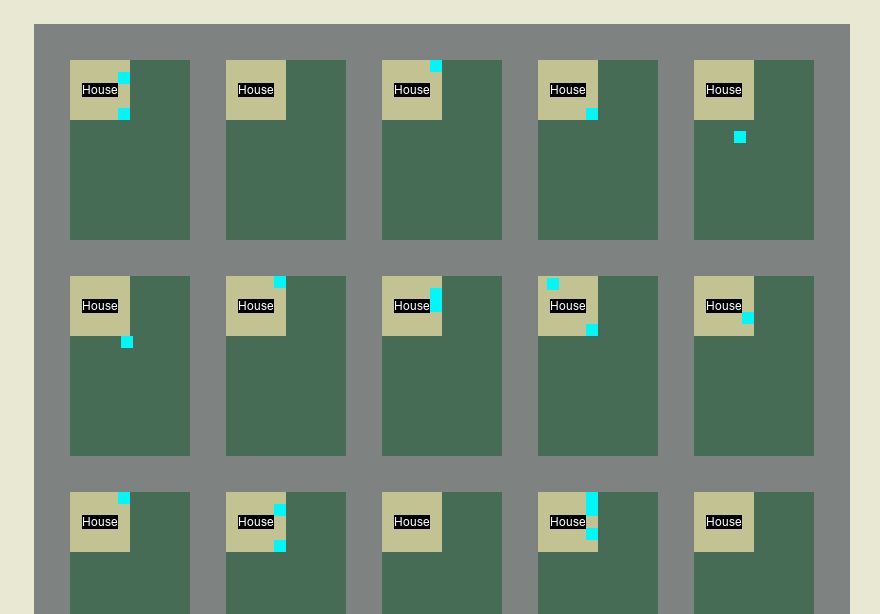

# Neighborly: Town-Scale Social Simulation Engine



Neighborly is a framework that simulates characters in a virtual town. It takes lessons learned from working with
[_Talk of the Town_](https://github.com/james-owen-ryan/talktown)
and gives people better documentation, simpler interfaces, and more opportunities for extension and content authoring.

## How to use

In the `samples` directory you can find examples of how to create and run a Neighborly simulation instance. To run
these, you need download or clone this repository locally, install the dependencies, and install a development build.

```bash
# Step One: Clone Repository
git clone https://github.com/ShiJbey/neighborly.git

# Step Two (Optional): Create and activate python virtual environment
cd neighborly

# For Linux and MacOS
python3 -m venv venv
source ./venv/bin/activate

# For Windows
python -m venv vev
./venv/Scripts/Activate

# Step Three: Install local build and dependencies
python -m pip install -e .
```

## Running the Tests

Please follow the steps for how to use then run the following to download the dependencies for running tests.

```bash
python -m pip install -e ".[tests]"
```

Then just enter `pytest` in the command line.

## Running the Samples

Please follow the steps for how to use then run the following to download the dependencies for running the samples.

```bash
python -m pip install -e ".[samples]"
```

Now you may execute any of the tests using `python ./samples/<sample_name>.py`.

## Contributing

If you are interested in contributing to Neighborly, feel free to fork this repository, make your changes, and submit a pull-request. Please keep in mind that this project is a tool for creativity and learning. We have a [code of conduct](./CODE_OF_CONDUCT.md) to encourage healthy collaboration, and will enforce it if we need to.

**WARNING::** This repository's structure in in high flux. Parts of the code get shifted to make the API's cleaner for use.

Here are some ways that people can contribute to Neighborly:

1. Proposing/Implementing new features
2. Fixing bugs
3. Providing optimizations
4. Fixing typos
5. Filing issues
6. Contributing tutorials/how-to's to the wiki
7. Fixing grammar and spelling in the wiki
8. Creating new samples

## Notes

### To-Do

- [ ] Add functions for selecting what kind of business/place to add to the town. The CityPlanner class is responsible
  for adding new residents and businesses to the town.
- [ ] Parameters and functions for determining the relative population breakdown for character archetypes.
- [ ]

### Non-Deterministic Behavior

The goal of having a seeded pseudo random simulation is so that users experience deterministic behavior when using the
same starting seed. We try to remove all forms of non-determinism, but some slip through. The known areas are listed
below. If you find any, please make a new issue with details of the behavior.

- Names may not be consistent when using the same seed. Currently, names are generated
  using [Tracery](https://github.com/aparrish/pytracery). We would need to create a custom version that uses an RNG
  instance instead of the global random module to generate names.
