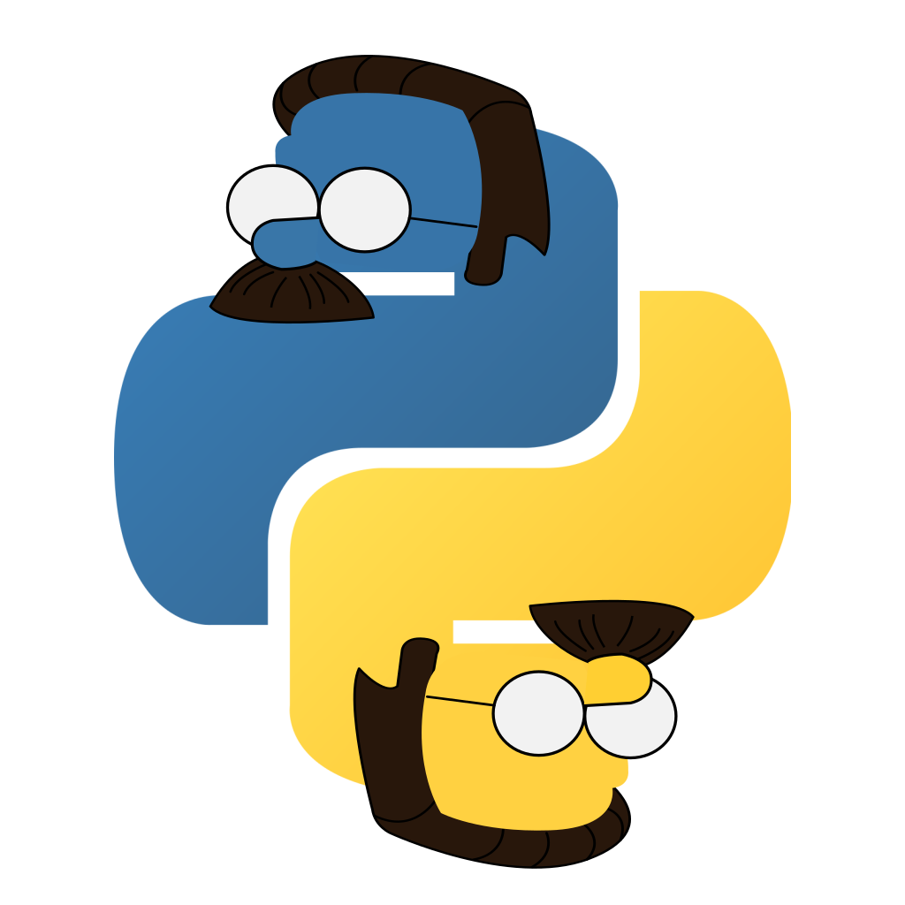

.. Neighborly documentation master file, created by
   sphinx-quickstart on Wed Apr 27 15:26:14 2022.
   You can adapt this file completely to your liking, but it should at least
   contain the root `toctree` directive.

Neighborly: Social Simulation
======================================

**Social simulation engine for procedurally generating towns of characters**

.. image:: https://img.shields.io/pypi/dm/neighborly
   :alt: PyPI downloads per month
.. image:: https://img.shields.io/pypi/l/neighborly
   :alt: PyPI license
.. image:: https://img.shields.io/pypi/v/neighborly
   :alt: PyPI package version
.. image:: https://img.shields.io/pypi/pyversions/neighborly
   :alt: PyPI supported python versions

.. image:: ./resources/pygame_sample_screenshot.png
   :alt: Neighborly Screenshot in pygame

.. toctree::
   :maxdepth: 2
   :caption: Contents:

   modules

Overview
========

Neighborly is an social simulation engine that procedurally generates towns of
characters. It simulates the lives of each character, their jobs, routines,
relationships, and life events. Neighborly utilizes an entity-component system
architecture, and enables users to specify custom character types, businesses,
occupations, life events, and simulation systems. Neighborly takes lessons
learned from working with
`*Talk of the Town* <https://github.com/james-owen-ryan/talktown>`_
and aims to give people better documentation, simpler interfaces, and more
opportunities for extension and content authoring.

**Neighborly is not fully functional yet. I am actively working toward a
working release.**

# Core Features

* Create custom Character Archetypes and have them all interact within the same simulation
* Create custom Business and Occupation definitions
* Configure simulation data using YAML or in code with Python
* Plugin architecture allows users to modularize and share their custom content
* Low fidelity simulation simulates the macro events in character's lives (relationship milestones, job changes, victories, tragic events)
* Export simulation state to JSON for further data processing

Tutorials and How-to Guides
===========================

I plan to add these after I have finished implementing Neighborly's core
functionality. I will try to align them with the sample projects, but we
will see how the first pre-release looks. For now, loosely refer to the
samples. Although, they too lag behind breaking changes to the core codebase.

Installing from PyPI
====================

Neighborly is available to install via pip.

.. code-block:: bash

   pip install neighborly

Installing for local development
================================

If you wish to download a Neighborly for local development, follow the these instructions.

.. code-block:: bash

   # Step One: Clone Repository
   git clone https://github.com/ShiJbey/neighborly.git

   # Step Two (Optional): Create and activate python virtual environment
   cd neighborly

   # For Linux and MacOS
   python3 -m venv venv
   source ./venv/bin/activate

   # For Windows
   python -m venv venv
   ./venv/Scripts/Activate

   # Step Three: Install local build and dependencies
   python -m pip install -e "."

Running the Tests
=================

I am still working on providing a decent test suite, but the codebase
changes so frequently that it hasn't been worth the time. As modules
become more established, I will add proper tests for them. Feel free
to contribute tests. Remember to fork the repo, add your test(s), and
submit a pull request with a description of your test cases. Your commits
should only contain changes to files within the `tests` directory. If you
change any files in other parts of the project, your PR will be rejected.

Please follow the steps for how to use then run the following to download
the dependencies for running tests.

.. code-block:: bash

   # Step 1: Install dependencies for tests
   python -m pip install -e ".[tests]"

   # Step 2: Run Pytest
   pytest

Running the Samples
===================

Please follow the steps for how to use then run the following to download the
dependencies for running the samples.

.. code-block:: bash

   # Step 1: Install dependencies for samples
   python -m pip install -e ".[samples]"

   # Step 2: Run desired sample
   python ./samples/<sample_name>.py

Documentation
=============

Neighborly uses Numpy-style docstrings, we generate the documentation using Sphinx.

When adding docstrings for existing or new bits of code please use the following
references for how to format your contributions:

* `Sphinx Napoleon Plugin for processing Numpy Docstrings <https://www.sphinx-doc.org/en/master/usage/extensions/napoleon.html>`_
* `Example Numpy Style Docstrings <https://www.sphinx-doc.org/en/master/usage/extensions/example_numpy.html#example-numpy>`_

Building the documentation
--------------------------

.. code-block:: bash

   # Change to the docs directory
   cd docs

   # Call the make file
   make html

   # Serve via local http server
   python -m http.server 8080 --directory _build/html

Contributing
============

If you are interested in contributing to Neighborly, feel free to fork this repository, make your changes, and submit a pull-request. Please keep in mind that this project is a tool for creativity and learning. We have a [code of conduct](./CODE_OF_CONDUCT.md) to encourage healthy collaboration, and will enforce it if we need to.

**WARNING::** This repository's structure in in high flux. Parts of the code get shifted to make the API's cleaner for use.

Here are some ways that people can contribute to Neighborly:

1. Proposing/Implementing new features
2. Fixing bugs
3. Providing optimizations
4. Fixing typos
5. Filing issues
6. Contributing tutorials/how-to's to the wiki
7. Fixing grammar and spelling in the wiki
8. Creating new samples

Notes
=====

Non-Deterministic Behavior
--------------------------

The goal of having a seeded pseudo random simulation is so that users experience deterministic behavior when using the
same starting seed. We try to remove all forms of non-determinism, but some slip through. The known areas are listed
below. If you find any, please make a new issue with details of the behavior.

* Names may not be consistent when using the same seed. Currently, names are generated
  using `Tracery <https://github.com/aparrish/pytracery>`_. We would need to create a custom version that uses an RNG
  instance instead of the global random module to generate names.

DMCA Statement
--------------

"Upon receipt of a notice alleging copyright infringement, I will take
whatever action it deems appropriate within its sole discretion, including
removal of the allegedly infringing materials."

"The repo image is something fun that I made. I love *The Simpsons*, and I
couldn't think of anything more neighborly than Ned Flanders. If the copyright
owner for *The Simpsons* would like me to take it down, please contact me.""

"The same takedown policy applies to any code samples inspired by TV shows,
movies, and games.""

Indices and tables
==================

* :ref:`genindex`
* :ref:`modindex`
* :ref:`search`
